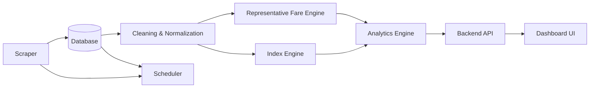

# SIH Problem 056 - Flight Fare Analytics Pipeline

This project aims to scrape, store, process, and analyze flight fare data to provide actionable travel insights.

## Project Flow

## Folder Structure & Components

- `scraper`: Fetches raw flight fare data.
- `database`: PostgreSQL configuration via Docker (init scripts, docker-compose).
- `cleaning-normalization`: Cleans raw scraped data and enforces schema consistency.
- `representative-fare-engine`: Calculates aggregated fare statistics.
- `index-engine`: Computes fare indices (daily/weekly/monthly).
- `analytics-engine`: Advanced data analysis, trend calculation, and optimization logic.
- `scheduler`: Orchestrates automated scraping and processing tasks.
- `backend-api`: Exposes data to the frontend.
- `dashboard-ui`: The user interface for visualizing insights.
- `testing`: Automated test suites.
- `documentation`: Additional project documents and specs.

## Getting Started

Please see [AGENT_SETUP.md](AGENT_SETUP.md) for instructions on how to set up your environment using our automated onboarding agent.

## Git Workflow

1.  **Work on feature branches:** `git checkout feature/your-feature`.
2.  **Sync frequently:** Keep your branch up to date with `develop` (`git merge develop`).
3.  **Open PRs:** When done, open a Pull Request to merge into `develop`.
4.  **Approval:** The Project Owner reviews and merges into `develop`.
5.  **Release:** Merges to `main` occur only when a stable release is ready.
