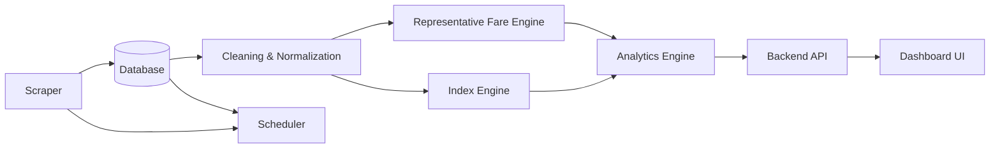

# System Data Flow & Architecture

This document tracks how data flows through the SIH Problem 056 pipeline and connects to our Docker-based PostgreSQL database.

## High-Level Data Flow

## Database Integration (Docker)

All tools must adhere to the standardized DB connectivity defined in `database/README.md`.

### Automation Standards (for Agents/Devs)
- **Database Access**: Always use environment variables defined in `.env` (managed via `DATABASE_URL`).
- **Data Integrity**: Components like `cleaning-normalization` MUST ensure schema compliance before any `INSERT` operations into the database.
- **Data Insertion**: Use standardized SQL or safe ORM patterns defined within each component's context.

## Component Roles
- **Scraper**: Ingests raw data, writes to staging tables in DB.
- **Cleaning-Normalization**: Reads from staging, cleans, writes to structured tables.
- **Representative Fare Engine / Index Engine**: Reads from structured tables, performs aggregation, writes to analytic tables.
- **Analytics Engine**: Reads analytic tables, runs complex logic, writes to insights tables.
- **Backend API**: Reads from all tables to serve the UI.
- **Scheduler**: Orchestrates the above via DB flags/status or direct container triggers.
